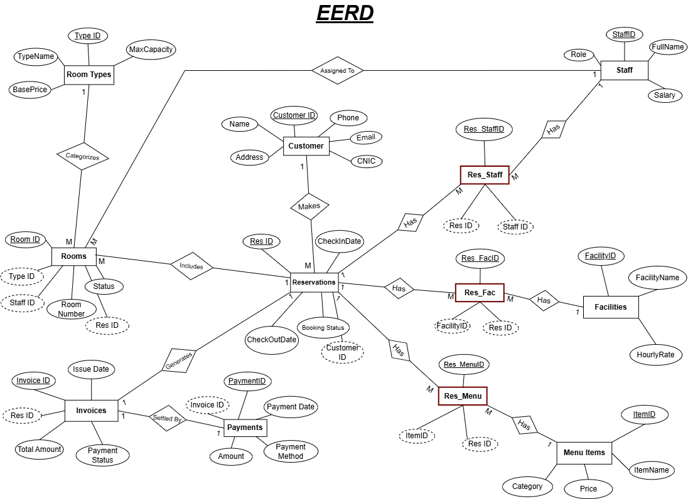

#  Resort Booking Database System (MS SQL)

A production-ready relational database management system designed to handle the core operational workflows of a luxury resort hospitality business. This backend system coordinates customer management, room inventory, multi-tiered facility tracking, restaurant dining transactions, billing, and system auditing.

---

## Database Architecture (EERD)

The system architecture features a highly normalized schema spanning 15 specialized tables[cite: 1, 3]. It utilizes core operational records, multi-entity bridge tables, and automated ledger tables to capture the entire guest lifecycle without data redundancy[cite: 1].



---

## Key Database Features Implemented

### 1. Advanced Procedural Business Logic
* **Automated Billing Engine (`sp_GenerateInvoice`):** A stored procedure that acts as a centralized checkout engine[cite: 1]. It utilizes relational aggregation loops and built-in datetime mathematics (`DATEDIFF`) to dynamically consolidate multiple operational streams into a singular invoice:
  * **Accommodation Costs:** Base room tier rates multiplied by calculated nights stayed[cite: 1].
  * **Amenity Utilization:** Real-time calculation of custom facility hourly rates against recorded usage durations[cite: 1].
  * **Hospitality Orders:** Food and beverage costs calculated dynamically by tracking quantity-to-menu pricing maps[cite: 1].
* **Transactional Integrity (`sp_ProcessPayment`):** Encapsulates the financial ledger processing within explicit ACID-compliant database transaction blocks (`BEGIN TRANSACTION`) to guarantee safe execution states[cite: 1]. If an error occurs mid-payment, changes rollback completely to avoid corrupted financial records[cite: 1].

### 2. Event-Driven Automation & State Enforcements
* **Inventory Lifecycle Control (`trg_AutoFreeRoom`):** A T-SQL trigger tied directly to reservation system data modifications[cite: 1]. The moment a reservation status shifts into a final system state (`Completed` or `Cancelled`), the engine handles internal state propagation, immediately freeing up the underlying physical asset and restoring the room inventory state to `Available`[cite: 1].
* **Pre-emptive Validation Engine (`sp_CreateReservation_Simple` & `sp_UpdateReservationStatus`):** Backend security checks that prevent illegal state assignments—such as stopping bookings on an already `Occupied` room, or rejecting a guest checkout if an invoice balance state remains `Pending`[cite: 1].

### 3. Comprehensive System Auditing
* **Destructive Operation Tracking (`trg_LogDeletedReservation`):** Utilizes system-level virtual execution tables (`deleted`) combined with global context parameters (`SYSTEM_USER`) to catch administrative operations, preserving an unalterable history of dropped reservations[cite: 1].
* **Data Mutation Ledgers (`trg_TrackSalaryChanges`):** Column-specific auditing triggers that watch for internal payroll changes, logging `OldSalary` vs `NewSalary` mutations strictly when data actually diverges[cite: 1].

### 4. Optimized Analytics & Relational Querying
* **Relational Algebra Mastery:** Includes advanced diagnostic testing script files showcasing performance-ready implementations of:
  * **Complex Joins:** Structured utilization of Inner, Left, Right, Full Outer, Cross, and Self-referencing joins to pull operational performance metrics[cite: 1].
  * **Nested & Scalar Queries:** Subquery filtering using evaluation blocks (`GROUP BY`, `HAVING`, and nested `IN` structures) for deep database telemetry reporting[cite: 1].
  * **User Defined Functions (UDFs):** Inline Table-Valued Functions (`fn_GetAvailableRoomsByType`) and Scalar Value Calculators to extract real-time system lookups seamlessly[cite: 1].

---

## Project Directory Structure

Organize your files in the repository using this structural standard:

```text
├── EERD.png                          # Enhanced Entity Relationship Diagram file
├── EERD.pdf                          # High-resolution architectural diagram
├── ResortBookingSystem.pdf           # Technical documentation and data definitions
└── sql/
    ├── 01_schema.sql                 # Database creation and table definitions
    ├── 02_seed_data.sql              # 15+ descriptive rows of dummy data
    ├── 03_stored_procedures.sql      # Stored procedures for booking, invoices, and payments
    ├── 04_triggers.sql               # State synchronization and auditing triggers
    ├── 05_functions.sql              # Custom lookups and valuation functions
    └── 06_queries_and_analytics.sql     # Complex selection filters and analytics tests
